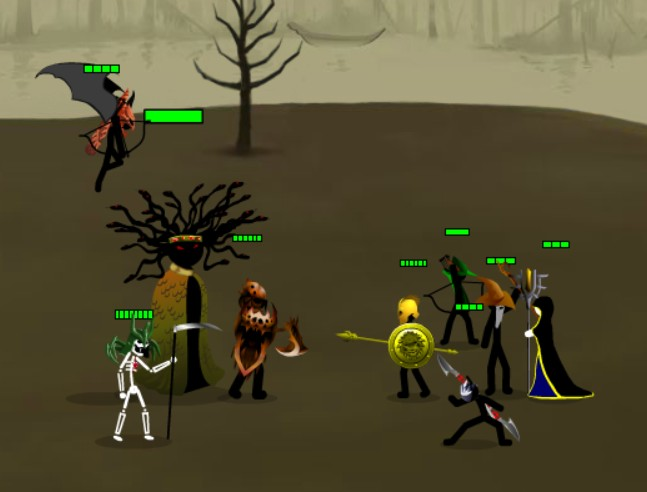
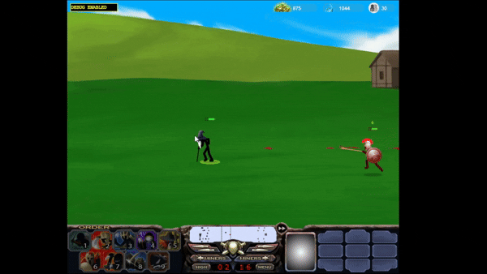
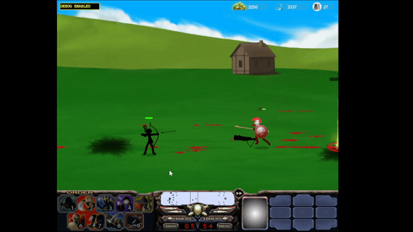
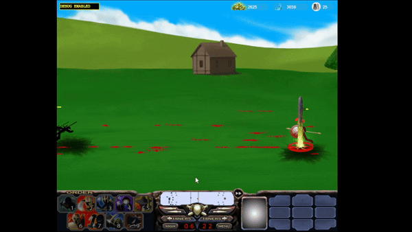

# Stick War 2: Enhanced Edition Mod

`Stick War 2: Enhanced Edition Mod` is a campaign-focused overhaul of `Stick War 2` that expands boss fights, improves enemy behavior, adds new level events, rebalances campaign progression, replayable levels and fixes several bugs/performance issues from the original game.

This mod is built for players who want the original campaign to feel more dramatic, more reactive, and more boss-heavy while still keeping the classic Stick War 2 feel.

## How to Play

1. Open `flashplayer_32_sa.exe`, or any standalone Flash Player projector.
2. Drag `Stick_War_2_Upgrades.swf` into the Flash Player window.
3. Start a campaign and play normally.

Modern browsers usually cannot run Flash content directly, so the standalone projector is recommended.

## Main Features

- Expanded campaign boss encounters for both Order and Chaos factions.
- New Chaos boss reinforcements in their own levels and in `Medusa's Gates`.
- Smarter campaign enemy AI with better army advantage checks and less awkward cautious attacks.
- Campaign reinforcements with temporary statue protection to prevent instant wave deletion.
- New boss abilities, passives, cosmetics, and phase behavior.
- Player-side toggles for Archidons, Shadowraths, and Magikill.
- Intro video now plays directly on the intro screen instead of only showing a link.
- Finished campaigns can replay completed levels from the campaign map.
- Upgrade screen is accessible directly from the campaign map.
- Reworked Medusa final boss encounter with stronger phases and summons.
- Bug fixes for crashes, spell edge cases, health bars, unit control, and campaign screens.
- Performance cleanup for debug overlays, campaign map updates, AI scans, and repeated logic.

## Boss Roster

### Order Bosses

- `Spearton Boss`
  - Uses `Shield Wall` and `Shield Bash`.
  - Commands nearby Speartons to brace with him.
- `Archidon Boss`
  - Uses `Fire Arrows`,`Arrow Storm`, `Triple Shot` and `Explosive Arrow`
  - Commands nearby Archidons to use `Fire Arrows` and `Arrow Storm`.
  - Can retreat and regroup with extra archers.
- `Shadowrath Boss`
  - Uses special boss cloak behavior.
  - Can chain cloak after successful attacks.
  - Flanks and targets supporting units when using special boss cloak
- `Magikill Boss`
  - Spell Changes.
  - Summons Swordwraths, Speartons, and Archidons.
  - Protects the enemy statue with a temporary ward.
- `Meric Boss`
  - Can revive fallen allies.
  - Prioritizes MagiKill Boss when reviving.

### Chaos Bosses

- `JuggerKnight Boss`
  - Uses boss-style charge pressure and enhanced durability.
  - Commands nearby JuggerKnights to charge with him.
- `Wingidon Boss`
  - Uses `Eclipse Mark`, `Demon Burst Fire`, and `Sky Commander Aura`.
  - Can direct nearby Wingidons toward marked targets.
  - Has anti-arrow pressure behavior to avoid instant archer deletion.
- `Skelator / Marrowkai Boss`
  - Uses `Dead Rising`, `Poison Fists`, and `Reaper Control`.
  - Summons limited Deads during low-health distancing phase.
  - Reaper-controlled units can temporarily attack their own allies.
  - Has poison immunity and poison deathburst behavior.
- `Medusa Boss`
  - Final boss version has stronger health, attacks, summons, and phase pressure.
  - `Look At Me` warns the player when units are turned to stone.

## Boss Abilities

### Spearton Boss

- `Shield and Bash`
  - Uses Shield Wall and Shield bash that stuns enemies that got hit.
  - Can command nearby Speartons to Shield and Bash with him

### Archidon Boss

- `Arrow Storm`
  - Fires a Blue glowing arrow that slows down enemies that got it.
  - Can command nearby Speartons to fire with him.
- `Fire Arrows`
  - Shoots one fire arrow that does more damage.
  - Can command nearby Archidons to shoot fire arrows him.
- `Triple Shot`
  - Fires three arrows in a spread direction.
- `Explosive Arrow`
  - Fires an explosive arrow that explodes on impact damaging enemies in the area.

### Shadowrath Boss

- `Cloak 3`
  - Cloaks that last 12 seconds and same damage as Cloak 1.
  - Each successful hit can immediately cloaks again but this time same damage as Cloak 2 but lasts 1.5 seconds.
  - Flanks and targets
- Note: was thinking of adding clone ability but this Cloak 3 is already powerful enough i think
- `Cautious Phase`
  - Enters phase when below 50% HP
  - Goes to Meric for healing, if none, garissons for healing.
  - Enters Last Stand Phase when statue is attacked while healing
  - Leaves Cautious phase when healed to full health
- `Last Stand Phase`
  - Resets his special cloak cooldown
  - Can no longer go back to Cautious Phase

### Shadowrath Level

- `Disguise`
  - Shadowraths can disguise themselves as a miner to lure enemies thinking they are vulnerable and ambushes them.

### MagiKill Boss

- `Meteor Chain`
  - Summoning a meteor will now chain along with 2 more meteors with only 70% damage of the default meteor spell
- `Lightning Wall Stun`
  - Lightning wall does low damage but stuns enemies for a while
- `Summoning`
  - Can summon a list of units:
  - `Spearton` Max 3
  - `Swordwrath` Max 2
  - `Archidon` Max 2

### Wingidon Boss

- `Eclipse Mark`
  - Fires a special marking arrow.
  - Marked units take bonus damage from the next Wingidon/Eclipsor projectile.
  - Nearby Wingidons can be encouraged to focus the marked target.
- `Demon Burst Fire`
  - Fires a short burst of arrows.
  - Hit units are stunned briefly.
- `Sky Commander Aura`
  - Temporarily empowers nearby enemy Wingidons.
  - Boss glows while the aura is active.

### Skelator / Marrowkai Boss

- `Dead Rising`
  - Available below 50% health.
  - Summons Deads beside the boss(Max 2).
- `Poison Fists`
  - Skeletal fists poison units they hit.
  - Poison fist visuals are attached to the fist impact.
- `Reaper Control`
  - Temporarily controls a struck enemy unit to attack its own allies.
  - Controlled units cannot be selected by the player.
  - Controlled Magikill can cast spells against its own allies.

## Campaign Changes

- Bosses appear in their own campaign levels.
- Chaos bosses also appear through reinforcements in `Medusa's Gates`.
- Several boss levels reward extra campaign points.
- `Rebels United` is built as a major multi-boss rebel encounter.
- `Medusa's Gates` now includes heavier Chaos Empire pressure.
- The final Medusa battle has improved pacing, music transitions, summons, and boss mechanics.
- The campaign intro now uses the embedded intro video on the intro screen.
- After finishing the campaign, completed levels can be replayed from the campaign map.
- The upgrade screen can now be opened from the campaign map.

## Unit Toggles

- `Magikill Autocast`
  - Cycle between `Auto Cast`, `Meteor Only`, and `Disabled Autocast`.
  - Magikill starts with autocast disabled.

- `Archidon Auto Kite`
  - Toggle between `Auto Kite` and `Manual Positioning`.
  - Archidons start in `Manual Positioning`.

- `Shadowrath Auto Cloak`
  - Toggle between `Auto Cloak` and `Manual Cloak`.
  - Shadowraths start in `Manual Cloak`.

## Controls

- `Z` - Scroll camera left
- `C` - Scroll camera right
- `F` - Toggle fast forward
- `P` or `Esc` - Pause
- `Space` - Select all non-miner units
- Double-tap `Space` - Jump camera to your forward unit
- `G` - Garrison or ungarrison selected units
- `U` - Ungarrison full-health units
- `I` - Select all garrisoned units
- `J` - Select poisoned units

## Optional Debug Keybinds

Debug mode is included for testing, screenshots, and messing around after finishing the campaign. All debug hotkeys require holding `Shift`.

### General Debug

- `Shift + F9` - Toggle debug mode on/off
- `Shift + F8` - Toggle full vision
- `Shift + F6` - Switch debug spawn set to `Order`
- `Shift + F7` - Switch debug spawn set to `Chaos`
- `Shift + 0` - Kill all enemy non-statue units and lock enemy unit training

### Order Debug Set

- `Shift + F1` - Spawn enemy Spearton Boss
- `Shift + F2` - Spawn enemy Archidon Boss
- `Shift + F3` - Spawn enemy Shadowrath Boss
- `Shift + F4` - Spawn enemy Magikill Boss
- `Shift + F5` - Spawn enemy Meric Boss
- `Shift + 1` - Spawn allied Spearton
- `Shift + 2` - Spawn allied Archidons
- `Shift + 3` - Spawn allied Magikill + Meric
- `Shift + 4` - Spawn allied Enslaved Giant
- `Shift + 5` - Spawn allied Shadowrath
- `Shift + 6` - Spawn enemy Spearton
- `Shift + 7` - Spawn enemy Archidons
- `Shift + 8` - Spawn enemy Shadowrath at enemy base
- `Shift + 9` - Spawn enemy Magikill + Meric

### Chaos Debug Set

- `Shift + F1` - Spawn enemy Knight Boss
- `Shift + F2` - Spawn enemy Wingidon Boss
- `Shift + F3` - Spawn enemy Skelator / Marrowkai Boss
- `Shift + F4` - Spawn player-owned boss lineup for thumbnails/screenshots
- `Shift + 1` - Spawn enemy Knight
- `Shift + 2` - Spawn enemy Dead
- `Shift + 3` - Spawn enemy Wingidon
- `Shift + 4` - Spawn enemy Skelator / Marrowkai
- `Shift + 5` - Spawn enemy Medusa
- `Shift + 6` - Damage enemy statue by `250`

## AI Improvements

- Enemy campaign strategy now reacts better to army advantage and disadvantage.
- Hidden Shadowrath forces are counted more intelligently.
- Shadowrath disguise/trap behavior is more coordinated.
- Boss support units stay more relevant around their boss.
- Enemy reinforcements are less likely to be instantly deleted on spawn.
- Expensive AI scans were reduced or cached where possible.

## Bug Fixes and Polish

- Fixed multiple boss health bar issues caused by damage-reduction-only stat changes.
- Fixed debug spawning crashes when spawning units from the wrong empire.
- Fixed Reaper Control cleanup so units return to normal after control ends.
- Fixed Reaper-controlled units hitting flying units when they should not.
- Fixed Magikill friendly-fire spell behavior while Reaper-controlled.
- Fixed Poison Fists behavior so the fist hit applies poison while the effect stays visual.
- Fixed campaign map and intro debug overlays showing on-screen.
- Fixed several lag spikes from repeated debug/stat display updates.
- Fixed campaign map update logic and prewarm behavior.
- Fixed several Shadowrath disguise edge cases.
- Fixed startup intro loading errors by handling failed intro loads safely.

## Performance Notes

This mod includes a lot of new boss logic, but several heavy debug and repeated-update systems were removed or reduced before release:

- Removed large per-frame debug stat overlay updates.
- Removed map coordinate debug display.
- Removed intro frame/debug display.
- Reduced repeated AI target scans through caching.
- Reduced repeated campaign map UI updates.
- Reduced repeated tutorial/enemy command spam.

Normal debug keybind checks are lightweight and only run deeper checks while `Shift` is held.

## Music Notes

Campaign levels use a mix of:

- `battleOfTheShadowElves`
- `enteringTheStronghold`
- `chaosInGame`
- `fieldOfMemories`(Only used in boss fight)

The final Medusa level starts with `battleOfTheShadowElves` and later switches to `fieldOfMemories` during the true boss fight.

## Requirements

- Windows is recommended.
- Standalone Flash Player projector is required.
- Included projector: `flashplayer_32_sa.exe`
- Game file: `Stick_War_2_Upgrades.swf`

## Notes for Players

- This is a campaign overhaul, not a full new game.
- Some encounters are intentionally harder than the original campaign.
- Boss fights are designed around pressure, reinforcements, and phase behavior.
- If something feels unusually broken, save your file and report the level, difficulty, and what happened.

## Credits

- Original `Stick War 2` by its original creators.
- Enhanced Edition Mod by ChorlsChu / Charles.
- Modding, scripting, balance changes, boss design, bug fixing, and testing were built on top of the original Flash/AS3 project.

## Disclaimer

This is a fan-made mod project. It is not an official Stick War release.

And yes, formal commits were absolutely forgotten along the way. Oopsies.
